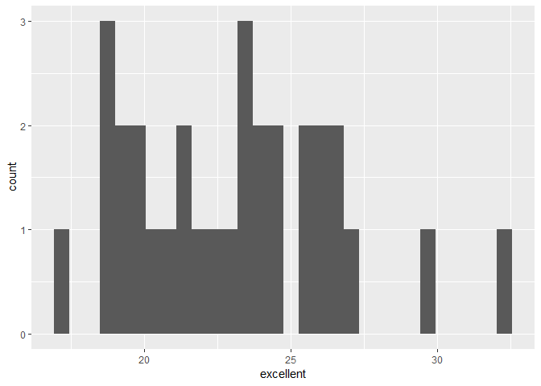

p8105\_hw2\_pc2853
================
pengxuan chen
October 5, 2018

------------------------------------------------------------------------

Problem 1
=========

``` r
transit_data = 
  read.csv("./data/NYC_Transit_Subway_Entrance_And_Exit_Data.csv") %>% 
  janitor::clean_names() %>% 
  select(line, station_name, station_latitude , station_longitude, route1:route11, entry, vending, entrance_type, ada) %>% 
  mutate(entry = recode(entry, "YES" = TRUE, "NO" = FALSE))
```

This is the description of the data. The data "transit\_data" is a manipulated version of the original data with cleaned names and selected variables which are "line, station\_name, station\_latitude , station\_longitude, route1:route11, entry, vending, entrance\_type, ada". I mutate the entry variable from character to logical. It is tidy enought in my perspective. I did not use "gather" to combine the routes served, since the columns are just spaces provided to show the routes served based on each station, and the columns cannot be the "key". If the routes columns are gathered, they will lost their correlation to the station in specific. But also there are some values in routes that are NA, as well as some values are blank. The dimension of the dataset is that it has 1868 of rows and 19 of columns.

-   The number of distinct stations are 465.
-   The number of stations that are ada complient is 468.
-   The proportion of station entrances / exits without vending allow entrance is 0.3770492.

Problem 2
=========

``` r
wheel_data = 
  readxl::read_excel("./data/HealthyHarborWaterWheelTotals2018-7-28.xlsx", range = cell_cols(1:14)) %>% 
  janitor::clean_names() %>% 
  filter(dumpster != is.na(TRUE)) %>% 
  mutate(sports_ball_int = as.integer(sports_balls))
```

The dataset "wheel\_data" is a manipulated version of the original dataset "HealthyHarborWaterWheelTotals2018-7-28.xlsx", which is the newly updated one that already combined 2016&2017 data and has both the year and the month variables. The data is cleaned via excluding the variable that is not correlated specific "dumpster". The number of observation of this dataset is 285. The variables are all related to each specific "dumpster" ordered by number, with date occured specified. Also, the precipitation in the dataset is seperated into different trash type, for example, "plastic bottles", "glass bottles", and "cigarette butts" and so on.The variable "sports balls" has been turned into integar by creating a new variable called "sports\_balls\_int".

-   The total precipitation in 2017 in weights is 174.84 in tons.
-   The median number of sports balls in a dumpster in 2016 is 26.

Prblem 3
========

``` r
health_data = 
  (brfss_smart2010) %>% 
  janitor::clean_names() %>%  
  select(-class, -topic, -question, -sample_size) %>% 
  select(-confidence_limit_low:-geo_location) %>% 
  filter(response == c("Excellent", "Very good", "Good", "Fair", "Poor")) %>% 
  spread(key = response, value = data_value) %>% 
  janitor::clean_names() %>% 
  
  mutate(excellent_or_very_good = excellent + very_good)
```

    ## Warning in response == c("Excellent", "Very good", "Good", "Fair", "Poor"):
    ## longer object length is not a multiple of shorter object length

This is a dataset manipulated from the original online "brfss\_smart2010" data. In the cleaning process, the name of the data is converted propably. The variable "class, topic, question, sample size and everyting from lower limit confidence to Geolocation" are excluded from the dataset. Then the elements without a response from "excellent" to "poor" are excluded. In this case I used the command "spread" to set the elements "excellent" to "poor" as columns to revised the data. At the end the new variable combining "excellent" and "very good" as one is added.

-   There are 50 states included in the dataset with 269 different county/locations included in total. In this case, all 50 states in US are represented. The most observed state is shown in the chunk below, which is NJ that was observed 36 times in the data.

``` r
sort(table(health_data$locationabbr))[50]
```

    ## NJ 
    ## 36

-   The median of the "excellent response value is 22.

-   Below is the histogram of "excellent" response values of year 2002. The dataset is the subset from "health\_data" that has the value from 2002 only. The x axis is chose to be the value of "excellent". The width of the bin is picked as default.

``` r
ggplot(subset(health_data, year == 2002), aes(x = excellent)) + geom_histogram()
```

    ## `stat_bin()` using `bins = 30`. Pick better value with `binwidth`.

    ## Warning: Removed 5 rows containing non-finite values (stat_bin).



-   Below is the histogram of "excellent" response value of both New York County and Queens County. The dataset is chose only with the element NY - New York County and NY - Queens County in the locationdesc variable. element missing "excellent" value is excluded in the graph.

``` r
ggplot(subset(health_data, locationdesc == "NY - New York County"| locationdesc == "NY - Queens County"), aes(x = year, y = excellent)) + geom_point()
```

    ## Warning: Removed 1 rows containing missing values (geom_point).


